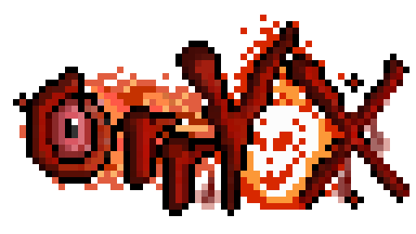

<p align="center">
  
</p>

<h1 align="center">Orryx Client</h1>

<p align="center">
  Minecraft 1.12.2 客户端模组 — 提供服务端可控的视觉效果与辅助功能
</p>

---

## 简介

Orryx Client 是一个基于 Minecraft Forge 1.12.2 的客户端模组，专为服务端插件开发者设计。服务端可通过自定义网络协议远程控制客户端的视觉效果、瞄准辅助、自动寻路等功能，无需客户端玩家手动操作。所有功能均以模块化方式组织，支持独立启用/禁用。

## 功能模块

### Aim — 技能辅助瞄准

提供三种瞄准模式，由服务端发起请求，客户端完成瞄准后将结果回传：

- Point（点选模式）：选择视线命中的方块位置或最远落点
- Direction（方向模式）：选择一个归一化朝向方向
- Area（区域模式）：选择与画面指示器一致的区域中心点
- 支持 Texture、Circle、Model 三种瞄准指示器，可配置颜色、透明度、半径与缩放

### Bloom — 泛光效果

基于 OpenGL Shader 的实体泛光渲染系统：

- 多 Pass 高斯模糊 + FBO 合成管线
- 支持自定义颜色、强度、半径、优先级
- 服务端可远程同步/更新/移除泛光配置
- 自动检测 OptiFine 光影包，冲突时自动禁用

### Effect — 视觉效果

三种实体视觉效果：

- Ghost（残影）：实体移动时产生半透明残影轨迹
- Flicker（闪烁）：实体周期性透明度闪烁
- EntityShow（实体投影）：在指定位置投影显示实体模型，支持淡入淡出

### Mouse — 鼠标控制

服务端可远程控制客户端鼠标指针的显示/隐藏，用于自定义 UI 交互场景。

### Navigation — 自动寻路

集成 Baritone API，服务端可指定目标坐标，客户端自动规划路径并移动到目的地。

### Shockwave — 地面冲击波

三种冲击波形状，附带方块破碎粒子动画：

- Circle（圆形）：以指定半径扩散
- Square（矩形）：指定长宽范围
- Sector（扇形）：指定半径和角度

### Collider — 碰撞体线框

服务端可创建、更新和移除客户端调试线框：

- Sphere、AABB、OBB、Capsule、Ray
- 支持有限深度的 Composite 组合碰撞体
- 对坐标、尺寸、递归深度和总节点数执行安全校验

## 技术特性

- 注解驱动的模块系统：`@Feature` 注解 + `FeatureBase` 基类，自动扫描注册
- 自定义二进制网络协议：`orryxmod:main` 频道，20 种包类型，带有限值、长度、集合和递归预算限制
- OpenGL Shader 管线：自定义 ShaderManager，管理 GLSL 着色器的编译、链接和渲染
- Mixin 字节码注入：修改原版 HUD 渲染和 Baritone 设置
- Kotlin 协程：异步处理耗时操作
- 自定义事件总线：支持事件优先级和取消机制
- 可调性能保护：Shockwave 分 tick 预算、Bloom 候选缓存、Collider 距离 LOD、实体追踪与 Display List 有界缓存

## 构建方式

前置要求：JDK 17（构建运行时）；产物字节码仍兼容 Java 8。

```bash
./gradlew shadowJar
```

独立单元测试构建使用 Gradle 8.9，并关闭构建缓存：

```bash
gradle --no-build-cache -b build-test.gradle test
```

构建产物输出到 `builds/` 目录。

## 安装方式

1. 安装 Minecraft Forge 1.12.2（版本 14.23.5.2864）
2. 将构建产物 JAR 文件放入 `.minecraft/mods/` 文件夹
3. 启动游戏

## 命令列表

所有命令以 `.` 为前缀，在游戏聊天栏中输入。

### 通用命令

| 命令 | 说明 |
|------|------|
| `.help` | 显示所有命令帮助 |
| `.features` | 列出所有已注册 Feature 及状态 |
| `.enable <id>` | 启用指定 Feature |
| `.disable <id>` | 禁用指定 Feature |

### Aim

| 命令 | 说明 |
|------|------|
| `.aim [point\|dir\|area] [texture\|model\|circle] [scale] [maxDist]` | 启动瞄准并选择指示器 |
| `.cancelaim` | 取消瞄准 |

### Bloom

| 命令 | 说明 |
|------|------|
| `.bloom [on\|off\|toggle\|status]` | 泛光开关/状态查询 |
| `.bloomadd <name> [r] [g] [b] [strength] [radius] [priority]` | 添加泛光配置 |
| `.bloomremove <name>` | 移除泛光配置 |
| `.bloomclear` | 清除所有泛光配置 |
| `.bloomlist` | 列出泛光配置 |
| `.bloomtest [r] [g] [b] [strength]` | 对自己应用泛光测试 |
| `.bloommax [n]` | 设置最大泛光实体数 |

### Effect

| 命令 | 说明 |
|------|------|
| `.ghost [ms] [density]` | 残影效果 |
| `.flicker [ms] [alpha]` | 闪烁效果 |
| `.shadow [ms] [offsetX]` | 添加影子分身 |
| `.clearshadow` | 清除影子分身 |
| `.entityshow [ms] [alpha] [fadeOut] [offsetX]` | 实体展示效果 |

### Mouse

| 命令 | 说明 |
|------|------|
| `.mouse [show\|hide\|toggle]` | 鼠标光标控制 |

### Navigation

| 命令 | 说明 |
|------|------|
| `.nav [x] [y] [z]` | 自动寻路到指定坐标 |
| `.stopnav` | 停止导航 |

### Shockwave

| 命令 | 说明 |
|------|------|
| `.shock [r]` | 圆形冲击波（默认半径 5） |
| `.shock2 [l] [w]` | 矩形冲击波 |
| `.shock3 [r] [angle]` | 扇形冲击波 |

### Collider

| 命令 | 说明 |
|------|------|
| `.collider sphere [radius]` | 创建球体线框 |
| `.collider aabb [hx] [hy] [hz]` | 创建轴对齐盒线框 |
| `.collider obb [hx] [hy] [hz]` | 创建带朝向的盒线框 |
| `.collider capsule [radius] [halfHeight]` | 创建胶囊体线框 |
| `.collider ray [length]` | 创建视线射线 |
| `.collider clear` | 清除所有碰撞体线框 |

## 服务端插件对接

- 完整频道、数据包字段、限制与 Collider wire ID：[`docs/Plugin-Integration.md`](docs/Plugin-Integration.md)
- 客户端性能配置、默认值与硬上限：[`docs/Performance-Limits.md`](docs/Performance-Limits.md)

## 开发依赖

| 依赖 | 版本 | 用途 |
|------|------|------|
| Minecraft Forge | 14.23.5.2864 | 模组加载框架 |
| Kotlin | 1.9.0 | 主要开发语言 |
| Kotlin Coroutines | 1.7.2 | 异步处理 |
| SpongePowered Mixin | 0.8.5 | 字节码注入 |
| Baritone API | 1.2 | 路径规划 |
| JOML | 1.10.7 | 3D 数学库 |
| Reflections | 0.9.12 | 运行时注解扫描 |

## 许可证

本项目基于 [MIT License](LICENSE) 开源。
